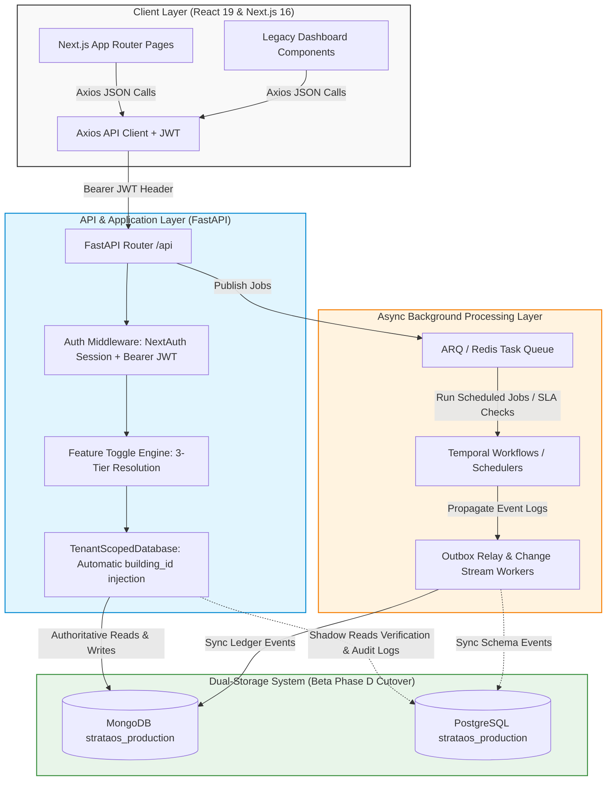
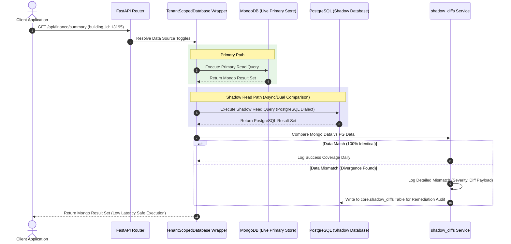

# StrataOS — Enterprise Multi-Tenant Strata Management Platform

<p align="center">
  
  
  
  
  
  
  
  
</p>

---

## 🌟 Executive Summary & Product Vision

**StrataOS** is a next-generation, production-grade, multi-tenant Software-as-a-Service (SaaS) platform engineered to modernize strata and apartment building management.
By replacing outdated legacy portals and fragmented tools with a single unified, secure, and highly intelligent workspace, StrataOS empowers Strata Management Companies, Executive Committees, and Residents with real-time financial control. 
Proactive maintenance tracking, streamlined legal compliance, and rich community features.

Designed to scale effortlessly to support thousands of buildings across multiple jurisdictions (e.g., ACT, NSW under Australian Strata Law), StrataOS treats every building as a completely isolated tenant scheme partitioned dynamically in the database layer. This ensures absolute privacy and robust tenant security.

### Why StrataOS? (The Value Proposition)

* **For Strata Management Companies**: Automate administrative overhead. Digitize invoice extraction (AI-powered OCR), levy run scheduling, and double-entry accounting. Unify portfolio-wide metrics in a single dashboard.
* **For Executive Committees (EC)**: Deliver total transparency over trust accounts, sinking funds, and capital work plans. Review and approve work orders and proposals with rigorous dual-control governance.
* **For Residents & Property Owners**: Deliver a premium self-service portal. View levy payment histories, submit maintenance requests with instant AI classification, reserve building amenities, and engage with neighbors via building-specific blogs and marketplace boards.
* **For Investors & Stakeholders**: An highly scalable SaaS architecture with predictable subscription models, a compliant double-entry ledger, and robust multi-tenancy safeguards engineered for enterprise adoption.

---

## 🏗️ High-Level Platform Architecture

StrataOS uses a decoupled, performance-optimized, and resilient service-oriented architecture:



### The MongoDB ↔ PostgreSQL Dual-Storage Pattern

We are currently transitioning our system of record from MongoDB to a highly transactional PostgreSQL schema. To achieve 100% data integrity without risking service disruption, we implement a **Phase D Shadow-Read Cutover** pattern:

> **Replication is not symmetric, and the asymmetry matters.** `workers/outbox_relay.py` runs **Postgres → MongoDB** and is an *audit log*, not a ledger sync. Which store actually *serves* a read is decided per-domain and per-building by `core.domain_cutover_status` — a feature toggle only means a PostgreSQL path *exists*. Where a domain has no row it fails closed to MongoDB, so live writes land in Mongo; until 2026-08-28 nothing carried them back and Postgres drifted silently (42 of 87 East Gate lots, $26,042.77, found only by a portal scrape). The **Mongo → Postgres** direction is covered by `backend/services/mongo_pg_finance_sync.py`, which diffs the two stores and emits the difference as Demo Bank intake candidates rather than mirroring rows — see `docs/architecture/mongo_postgres_finance_sync.md`. **That module shipped complete and unit-tested and was never once executed**: until 2026-08-29 its only caller was a manual `scripts/data_repair/` CLI, so the DR position it exists to protect was never actually measured. It now runs nightly at 03:30 as `workers/scheduler.py::finance_dr_drift_check` — read-only, reporting drift as a number to watch rather than raising, with emitting intake candidates left a deliberate human action. A unit test on a pure function cannot detect "nothing calls this"; `tests/backend/test_finance_dr_sync_wiring.py` asserts the wiring itself.

> **One dispatch seam.** New code never hardcodes a store. `backend/services/store_router.py::resolve_store(domain, building_id, operation)` is the single place that answers "which store serves this" — domain-generic, operation-generic, fails closed to MongoDB when a domain has no `core.domain_cutover_status` row, and never raises (a blocked domain or an unreachable control plane degrades to Mongo with the reason attached). Its `mirror_to_mongo` flag is true for every Postgres write while both stores are live, because an unmirrored Postgres write destroys the DR position silently. Reference implementation: `services/documents_store.py` over `db_postgres/repos/documents_repo.py`, the first non-finance Postgres **write** path in the codebase.



> **Note:** resolved route-state metadata (e.g. a route reporting `source=postgres`) is not itself
> proof that a request was actually served from PostgreSQL — only that the cutover control plane
> *considers* the route eligible. `finance.levy_kpi` reported `source=postgres` while its router
> handler had no Postgres serving code path at all and served Mongo unconditionally (`GAP-FIN-063`,
> confirmed 2026-08-12). Always verify provenance against the code path, not the metadata label.

For more architectural specifics, see the [Documentation Index](#-documentation-index) section.

---

## ⚡ Core Feature Directory

StrataOS provides a broad suite of modules carefully tailored to modern community operations:

| Domain                | Key Capabilities & Features                                                                                                                                                                           | Business Value                                                                                      |
|:----------------------|:------------------------------------------------------------------------------------------------------------------------------------------------------------------------------------------------------|:----------------------------------------------------------------------------------------------------|
| **Finance & Ledger**  | Real-time levy budget planning, automatic arrears recovery workflows, double-entry general ledger, supplier invoice processing (with AI OCR OCR engines), GST/BAS prep, and automated payout batches. | Eliminates accounting errors, secures trust accounts, and streamlines complex annual audit reviews. |
| **Maintenance & Ops** | Smart AI-assisted maintenance requests, automated work orders, digital twin asset registry, preventive maintenance schedules, and builder defect logging.                                             | Preserves asset value, reduces reactive repair expenses, and tracks SLA compliance.                 |
| **Governance**        | Digital AGM support, motion voting registers, committee proposal approvals, conflict of interest declarations, and official by-laws indexing.                                                         | Ensures democratic transparency and legal compliance with local strata regulations.                 |
| **Compliance & Risk** | Fire safety checks, swimming pool certificates, lift maintenance, WHS incident reporting, SWMS tracking, and building risk metrics.                                                                   | Prevents severe legal liability and secures insurance premium discounts for buildings.              |
| **Community & Chat**  | Building announcement broadcasting, private and group chat rooms, peer-to-peer marketplace listings, community calendars, and news boards.                                                            | Promotes high resident satisfaction, volunteer engagement, and connected communities.               |
| **Owner Hub**         | Direct ownership portal, property health monitoring, true cost of ownership metrics, and real-estate agent integration portals.                                                                       | Optimizes financial returns for property investors and simplifies landlord admin.                   |

---

## 💻 Developer Onboarding & Quick Start

### Prerequisites

* **Node.js**: `v22.x` (Configured in `.nvmrc`)
* **Python**: `3.12.x`
* **Package Manager**: `yarn` or `pnpm`
* **Databases**: Local instances of:
  * MongoDB (v6.0+) running on port `27017` (or `27018` for custom configurations)
  * PostgreSQL (v15+) running on port `5432`

---

### Backend Setup

1. **Navigate to backend and create virtual environment**:
   ```bash
   cd backend
   python3 -m venv venv
   source venv/bin/activate
   ```

2. **Install Python dependencies**:
   ```bash
   pip install -r requirements.txt
   ```

3. **Configure Environment Variables**:
   Copy the example environment file and adjust keys (JWT secret, DB URLs, etc.):
   ```bash
   cp .env.example .env
   ```

4. **Apply PostgreSQL Migrations**:
   ```bash
   # Ensure DATABASE_URL is set correctly in backend/.env
   alembic upgrade head
   ```

5. **Run Seed Scripts (Idempotent Sales/Onboarding Demo Data)**:
   ```bash
   python3 seeds/demo_customer.py
   ```

6. **Start the FastAPI Development Server**:
   ```bash
   uvicorn server:app --reload --host 127.0.0.1 --port 8003
   ```
   *The API will be available at `http://localhost:8003/api` and Swagger documentation at `http://localhost:8003/docs`.*

---

### Frontend Setup

1. **Navigate to the frontend directory**:
   ```bash
   cd frontend
   ```

2. **Ensure Node 22 is active**:
   ```bash
   nvm use
   ```

3. **Install JS dependencies**:
   ```bash
   yarn install
   # Or using pnpm:
   pnpm install
   ```

4. **Start the Next.js Dev Server**:
   ```bash
   yarn dev
   # Or using pnpm:
   pnpm dev
   ```
   *The client web application will be accessible at `http://localhost:3020`.*

---

## 🧪 Comprehensive Verification & Test Suite

Quality control, multi-tenant safety, and financial accuracy are enforced programmatically in StrataOS.

### 1. Running Backend Pytest Suites
All backend tests are written in Pytest. They assert strict multi-tenant isolation and verify that tenant-specific queries never leak cross-scheme data.

To execute backend tests:
```bash
# Run from repository root using the virtual env python to ensure deps are loaded
backend/venv/bin/python3 -m pytest tests/backend -q

# Run a specific file
backend/venv/bin/python3 -m pytest tests/backend/test_work_orders.py -q
```

### 2. Running Frontend Jest Unit Tests
We use Jest and React Testing Library (RTL) to test frontend hooks, state management, and page layouts.

To execute Jest tests:
```bash
cd frontend
yarn test --watchAll=false
```

### 3. Running Playwright End-to-End Tests
Playwright asserts high-fidelity browser behavior, visual regressions, and multi-tenant user flows (such as log-in and document access limits).

To execute E2E tests:
```bash
# Run all end-to-end suites
npx playwright test

# Run a specific user flow script with visual reporting
npx playwright test tests/frontend/e2e/rental-certificates.spec.js --reporter=list
```

### 4. Running k6 Performance & Load Benchmarks
k6 ensures StrataOS can sustain active community operations under heavy load. Load tests live in `tests/performance/`.

To run a k6 benchmark test locally (requires [k6 installation](https://k6.io/docs/get-started/installation/)):
```bash
k6 run tests/performance/dashboard_benchmark.js -e BASE_URL=http://localhost:8003/api -e AUTH_TOKEN=<token>

# Authenticated owner dashboard page/API fan-out
k6 run tests/performance/owner_dashboard_benchmark.ts -e BASE_URL=http://localhost:8003/api -e AUTH_TOKEN=<owner_jwt> -e UNIT_NUMBER=<owner_unit>

# Read-only finance pipeline readiness/API fan-out
k6 run tests/performance/finance_pipeline_benchmark.ts -e BASE_URL=http://localhost:8003/api -e AUTH_TOKEN=<jwt> -e BUILDING_ID=<scheme_number> -e UNIT_NUMBER=<unit_number>
```
*Note: Every load test implements a custom `teardown()` hook; mutating benchmarks must delete transient test records, and read-only benchmarks declare an explicit no-op teardown.*

`finance_pipeline_benchmark.ts` defaults to finance UI read endpoints. Add
`-e INCLUDE_PIPELINE_PROBES=1` only when the target building has the Demo
Bank/FIL and historical reconstruction feature gates enabled.

Grafana dashboard JSON for k6 metrics in a Prometheus-compatible store lives at
`monitoring/grafana/dashboards/strataos-k6-performance.json`; setup notes are in
`docs/performance/k6_grafana_performance.md`.

---

## 🔗 Key Architectural Invariants & Codebase Rules

Every contributor must adhere strictly to these engineering laws:

1. **Absolute Multi-Tenant Isolation**: Never hardcode a building scheme ID (e.g. `"13195"`) inside business code. Always extract `building_id` from the authenticated user's token (`Depends(get_current_building)`).
2. **Cents are the Only Truth**: Never represent financial values using floating-point numbers. Always use integer cents (`Cents`) at the data layer and convert dynamically on input boundaries.
3. **Soft-Archive Requirement**: Under NSW/ACT strata laws, records must be retained for 7 years. Never execute direct database `DELETE` statements on active schemes. Set `is_archived=True` and filter accordingly on listings.
4. **Always Wait for Auth Guards**: Any Next.js client component gating access based on roles (e.g. `isAdmin()`) must wait for `loading === false` to avoid false redirect loops.
5. **Effective Role Overrides**: Always use `effective_role` rather than `user["role"]` inside backend guards. During administrator impersonation, the raw role remains static while permissions elevate.
6. **Postgres Is What Login Reads**: `/auth/login` resolves `core.users` first and only falls back to MongoDB. Any change to credentials or account state must reach Postgres, or it updates a record authentication never consults — the old value keeps working and the new one does not. Three password paths had this defect until 2026-08-27.
7. **Demo Bank Is the Only Door Into Finance**: Every financial input — real bank feed, CSV/PDF import, portal scrape, reconstructed history, manual entry — must materialise as a row in Demo Bank's own collections before anything downstream sees it. Provider integrations are input *adapters*, never parallel paths into the GL. A code path that can create a financial fact without passing through that door is the bug, not the reconciliation that later disagrees with it. East Gate carried two disconnected 2021-2025 expense totals ($415,031.21 vs $1,502,451.24, diverging 3.6×) because two pipelines wrote the same facts and neither checked the other.
8. **A Concept Has One Owner**: Before writing a shared helper, check `docs/architecture/canonical_owners.yaml`. A call graph cannot detect a duplicate implementation — a re-implementation creates no edge to the original — so uniqueness is not derivable from any map. `lot → unit` resolution was rebuilt five times this way, and two functions named `dollars_to_cents` shipped side by side returning different money.
9. **No Email Leaves Un-Reviewed**: Outgoing mail is persisted to the outbound queue and released by a worker, never transmitted inline. A gate must be applied at *every* path capable of the write, not just the expected one — two crons bypassed the queue entirely while appearing guarded.

---

## 📖 Technical Documentation & User Guides

* **Resident & Manager Guides**: Located in `frontend/public/user-guides/`. (e.g. [Payment Matching Manager's Guide](frontend/public/user-guides/payment-matching.html))
* **Deep Tech Docs & Specifications**: Located in `frontend/public/tech-docs/`. (e.g. [Bank Feed Replay Engine Specification](frontend/public/tech-docs/bank-feeds-demo-bank.html))
* **Full Master Documentation Map**: A complete registry of architecture schemas, ADRs (Architecture Decision Records), and code-maps is detailed at **[docs/README.md](docs/README.md)**.

---

## 🏛️ Appendix: Live System Telemetry & Repository Inventory

*This appendix provides point-in-time statistics and historical context of the codebase state as we stabilize our features and execute our PostgreSQL database cutover.*

### Live Database Snapshot (Verified 2026-08-29)

#### MongoDB `strataos_production`
* **Collections**: `226` — `153` hold documents, `73` are empty.

#### PostgreSQL `strataos_production`
* **Active Schemas**: `15` (`access`, `ai_assist`, `analytics`, `communications`, `compliance`, `core`, `documents`, `finance`, `governance`, `modules`, `ops`, `powerhouse`, `public`, `sustainability`, `workflow`).
* **Tables & Views**: `230` across the 15 schemas.
* **Tables holding data**: `53`. **`177` are empty** — the schema is fully deployed, the data
  largely is not. Of the `153` populated Mongo collections, `25` have a populated Postgres
  home, `25` map to an empty Postgres table, and **`103` have no Postgres target at all**
  (including `unit_levy_ledger`, which half the finance UI reads from). Porting those routes
  is a data-modelling exercise, not a rewrite. The "mapped" half is partly heuristic
  name-matching, so treat it as a lead; only the `103` unmapped figure is firm.
* **Active Scheme Records**:
  * `13195` (East Gate Residences — Live production tenant)
  * `UPDEMO5` (StrataOS Demo Residences — the single platform demo, `is_demo=TRUE`)
* **Alembic Database Head**: `0105_documents_is_public`.

#### Cutover Position (Verified 2026-08-29)

**All eight East Gate domains are `mode=postgres_write, readiness=promoted`** —
`finance_ledger`, `governance`, `identity_core`, `occupancy`, `powerhouse_conversations`,
`settings`, `trust_ledger`, `trust_reconciliation`. Every other building is Mongo-served.

**The control plane is no longer the constraint — the routers are.** Only `10` of `132`
router files consult it; `103` call `db.<collection>` directly with no dispatch
(`73` mongo-only, `34` hybrid, `10` postgres-only, `15` no direct store — measured with the
datastore map regenerated against a live database; generated without one it under-reports
Postgres). `server.py` alone holds `189` inline routes touching `89` Mongo collections.

> **"Promoted" does not mean the router reads Postgres.** `GET /users` has been a
> Mongo-primary read UNIONed with Postgres since `identity_core` was promoted — coexistence,
> not cutover, and it is the best case in the tree. New code goes through the one dispatch
> seam, `backend/services/store_router.py::resolve_store`.

**The two stores agree on the unit ledger, and still differ on arrears.** The nightly DR
check (`workers/scheduler.py::finance_dr_drift_check`) reports East Gate at **87/87 lots
matching, $0.00 net gap**, and the FY2026 unit ledger matches to the cent on both sides
(`$220,187.56` levied / `$212,146.26` paid, verified by live query against each store).
**Arrears still diverges by one lot — PostgreSQL `14` units / `$8,041.30` against MongoDB
`13` / `$7,851.30`, a `$190.00` gap** (the known unbanked TH075 receipt). Two limits on the
DR number: it aggregates across all years, so a per-year mismatch that cancels is invisible;
and it compares two *derived* stores, so agreement is consistency, not correctness.
Separately, Postgres's internal allocation trail is incomplete: **`$224,733.13` of
`levy_items.paid_cents` has no `receipt_allocations` row**.

Full analysis and the six-phase plan:
[`docs/architecture/postgres_router_cutover_state_and_plan_2026-08-29.md`](docs/architecture/postgres_router_cutover_state_and_plan_2026-08-29.md).

#### East Gate (`13195`) Scoped Row Counts

**Removed 2026-08-25 — this table was hardcoded and every one of its 16 figures had gone stale.**

Spot-checked against the live database on 2026-08-25: `core.lots` read `87` here but is `0`;
`finance.levy_items` read `3,480` but is `0`; `finance.journal_lines` read `12,194` but is `0`.
East Gate's financial data was wiped on 2026-07-25 and has not been reloaded, so the table
described a database that no longer exists — while reading as current.

A hardcoded snapshot in a README cannot stay true, and a stale one is worse than none: it is
the same failure mode as the `$150,000` reserve default, where a plausible-looking figure was
trusted because nothing marked it as unverified. Regenerate on demand instead:

```bash
cd backend && python3 scripts/audits/generate_database_live_inventory.py   # read-only
```

That writes a dated inventory under `docs/architecture/` with exact per-table counts for both
stores. Cite the dated file, never inline numbers that will rot.

> Note when reading `core.users`: the bulk of that table is `is_test_data` rows leaked by the
> test suite (2,160 of 2,165 on 2026-08-25). They are all deactivated and cannot authenticate,
> but they are not yet purged — see `docs/deployment/backend_venv_rebuild.md` and
> `backend/scripts/data_repair/neutralise_leaked_test_users.py`.

> Live row counts as of `docs/architecture/database_live_inventory_2026-08-19.md`
> (regenerate with `backend/scripts/audits/generate_database_live_inventory.py`).

---

### Repository Directory Inventory

The following counts reflect actual file-system derived statistics from the StrataOS working tree:

* **FastAPI Router Modules**: `126` modules (mounted as active sub-routers under `server.py`).
* **Pydantic Data Models**: `56` declarative schema modules defining application contracts.
* **Core Business Services**: `109` service facades orchestrating business calculations and DB interactions.
* **Cron & Worker Daemons**: `30` distinct asynchronous scripts managing recurring SLAs and event-outbox replication.
* **Pytest Backend Tests**: `458` integration and unit test scenarios ensuring system safety.
* **Frontend Jest & RTL Tests**: `121` component layout and state tests.
* **Playwright E2E Tests**: `40` multi-browser automated user flow specifications.

---

### Engineering Change Log (Beta Development Highlights)

* **2026-08-28**: Closed the **Mongo → PostgreSQL** replication gap, the missing half of the dual-storage pattern. `finance.owner_credit_balances` — created by migration `0004`, given RLS by `0008`, and left with no writer for its entire life — is now populated from the canonical `compute_lot_true_balances`, so PostgreSQL can represent an owner's unapplied credit at all; previously it derived a lot's position as `charged − paid`, which cannot go negative, and reported **zero lots in credit** against a portal position of 34. With that representation in place Mongo and Postgres agree on **all 87 East Gate lots**, where 42 disagreed. Added `mongo_pg_finance_sync`, which diffs the stores and emits the difference as Demo Bank intake candidates rather than mirroring rows into `finance.*` — closing the gap *through* the single intake door instead of around it — plus a per-lot drift measure, because drift that is not measured is drift that is silent.
* **2026-08-12**: Confirmed `GAP-FIN-063` — `finance.levy_kpi`'s router handler had no PostgreSQL serving code path despite its resolved route-state metadata reporting `source=postgres`; the handler read that field only to decide whether to fire an async shadow-comparison task, never to select a data source, so every response was unconditionally computed from MongoDB. Corrected the affected cutover-status documentation and added an explicit provenance caveat to the Dual-Storage Pattern note above.
* **2026-08-03**: Financial calculation consolidation (GAP-FIN-040). Single canonical backend implementation per financial metric (arrears, collection rate, fund health), CI-enforced by a guardrail test that fails the build on any new inline or divergent finance calculation. Due-date Collection Rate, Fund Health / Full-Year Levy Coverage, and Collected in Advance are now three distinct, never-conflated metrics; arrears is per-unit and grace-aware (a credit on one unit never nets against another unit's arrears). Establishes one authoritative store + one reader per financial concept, with read-only cross-store reconciliation scripts.
* **2026-07-16**: Automated repository-wide AST scanner (`scripts/docs/generate_function_inventory.py`) tracking 6,600+ backend and frontend functions with automatic documentation generation mapped into FeatureTrace. Added durably cached database telemetry for legacy trust usage tracking.
* **2026-07-15**: Unified Management & Owner dashboards onto identical, highly-trusted financial services `/owner-hub/unit-tco` and `/finance/unit-dashboard-overview` to prevent UI value drift.
* **2026-07-14**: Completed Stage 1 of the trust account cutover. Deployed deprecation headers for trust V1 endpoints and routed all active workflows to high-performance `TrustAccountReadService` (V2).
* **2026-07-11**: Relocated historical data exports and legacy MongoDB dump folders to archival documentation paths (`docs/archive/`), reducing root-level clutter and speeding up deployment builds.
