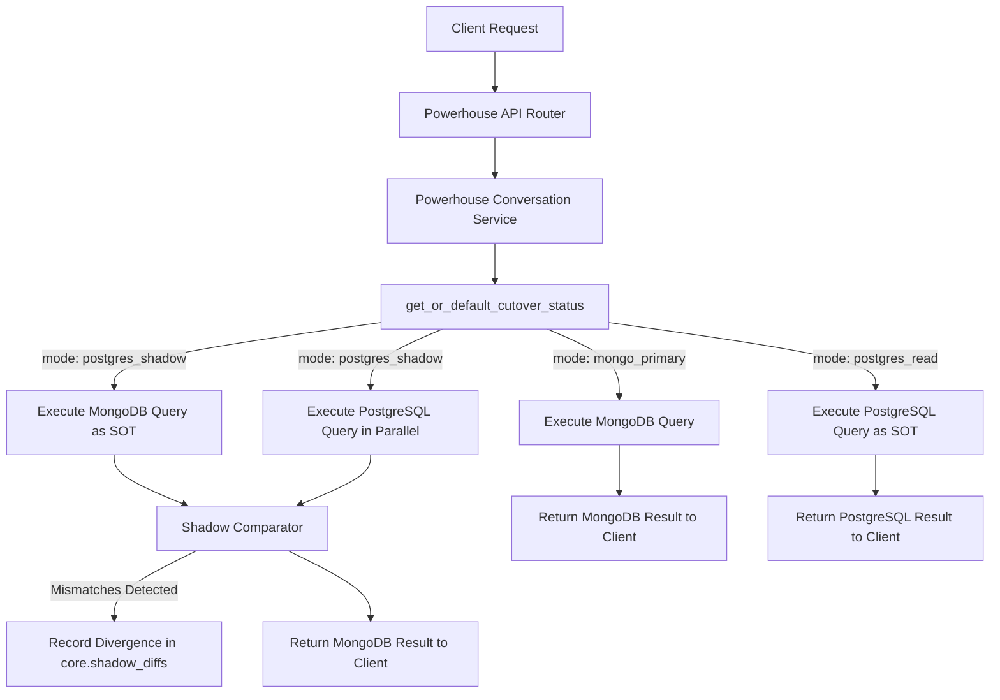

# Powerhouse MongoDB ↔ PostgreSQL Coexistence and Shadow-Read Architecture

**Date:** 2026-07-20
**Status:** `schema_defined`, `migration_authored`, `postgres_shadow_ready`
**Domain Toggles:** `powerhouse_conversations`, `powerhouse_workflows`
**Write Mode:** `postgres_writes_disabled` (unconditional fallback/fail-closed to MongoDB)

---

## 🌟 Executive Summary

To ensure 100% data integrity and robust tenant isolation during the phased migration from MongoDB to PostgreSQL, the **Powerhouse Conversations** and **Powerhouse Workflows** domains have been integrated into the StrataOS Source-of-Truth (SOT) Cutover Control Plane.

This document describes the design of the **Phase D Shadow-Read** architecture, canonical data-model mappings, payload normalization/comparison, automated divergence recording, and write-safety guards implemented for Powerhouse.

---

## 🏗️ Coexistence Architecture

The Powerhouse service acts as a coexistence layer that handles both MongoDB and PostgreSQL reads based on dynamic building-scoped cutover modes:



### 1. Powerhouse Cutover Domains

Two discrete cutover domains are registered in the control plane to enable granular, decoupled testing:

1. **`powerhouse_conversations`**: Governs inboxes, threads, participants, messages, and attachments.
2. **`powerhouse_workflows`**: Governs workflow templates, instances, execution steps, and automation rules.

### 2. Dual-Read Shadow Executor

When a domain is in `postgres_shadow` mode, `_execute_shadow_read` performs the following steps:
1. Evaluates the authoritative MongoDB coroutine (`mongo_coro`).
2. Evaluates the PostgreSQL shadow coroutine (`pg_coro`) in parallel.
3. Pass both results into a domain-specific normalization and comparison utility.
4. If any fields differ or record counts mismatch, computes a divergence score and logs details to `core.shadow_diffs`.
5. Unconditionally returns the MongoDB result to the user to prevent any user-visible behavioral changes.

---

## 📊 Canonical Schema Mapping

Conceptual model ownership is centralized across the following schemas:

| Entity | MongoDB Collection | PostgreSQL Target Schema/Table | Role |
| :--- | :--- | :--- | :--- |
| **Inbox** | `powerhouse_inboxes` | `communications.inboxes` | Inbox configurations |
| **Thread** | `powerhouse_conversation_threads` | `communications.conversation_threads` | Conversations |
| **Message** | `powerhouse_conversation_messages` | `communications.conversation_messages` | Messaging & Notes |
| **Participants** | Embedded array | `communications.conversation_participants` | Thread access list |
| **Watchers** | Embedded array | `communications.conversation_watchers` | CC / watcher users |
| **Links** | `powerhouse_conversation_links` | `communications.thread_entity_links` | Links to external objects |
| **Identifier Map** | N/A | `core.legacy_entity_mappings` | Bitemporal MongoDB-to-PG ID mapping |

---

## 🔍 Normalization & Comparator Logic

Timestamps, identifiers (ObjectIDs vs. UUIDs), and list orderings are normalized before comparison.

### Example Normalization Mapping (Threads)

```python
def _normalize_thread(thread: dict[str, Any]) -> dict[str, Any]:
    return {
        "id": str(thread.get("id") or thread.get("_id") or ""),
        "building_id": str(thread.get("building_id") or ""),
        "subject": str(thread.get("subject") or ""),
        "source_channel": str(thread.get("source_channel") or "portal_message"),
        "priority": str(thread.get("priority") or "normal"),
        "status": str(thread.get("status") or "open"),
        "visibility": str(thread.get("visibility") or "participants_only"),
        "participant_ids": sorted([str(p) for p in thread.get("participant_ids") or []]),
        "watcher_ids": sorted([str(w) for w in thread.get("watcher_ids") or []]),
        "linked_entity": thread.get("linked_entity"),
        "is_archived": bool(thread.get("is_archived")),
    }
```

---

## 🛡️ Write-Safety & Disabled Write Proof

Write operations to PostgreSQL are strictly disabled during this phase.
To prevent accidental dual-writes or invalid mutations on incomplete schemas, every mutating endpoint (e.g. `create_thread`, `add_message`, `assign_thread`) is guarded by `_assert_write_target`:

```python
async def _assert_write_target(building_id: str, domain: str) -> None:
    status = await get_or_default_cutover_status(building_id, domain)
    if status.write_source == DataSource.postgres:
        raise HTTPException(
            status_code=503,
            detail=f"PostgreSQL writes for domain '{domain}' are disabled during this phase.",
        )
```

- When the domain is in `mongo_primary` or `postgres_shadow` mode, writes default and execute cleanly against **MongoDB**.
- If the domain is promoted to `postgres_write`, the API will fail explicitly with an `HTTP 503 Service Unavailable`, preventing writes from routing to a write-disabled target.

---

## 🛠️ Verification Commands

To verify PostgreSQL readiness and schema completeness on the server, a standalone, read-only script is available:

```bash
backend/venv/bin/python3 backend/scripts/powerhouse_postgres_readiness.py --building-id 13195
```

The script reports:
1. Current Alembic version and schema migration integrity.
2. Required tables, indexes, and constraints presence.
3. RLS policy activation for communications and workflow schemas.
4. Cutover-domain modes and source-selection status for the building.
